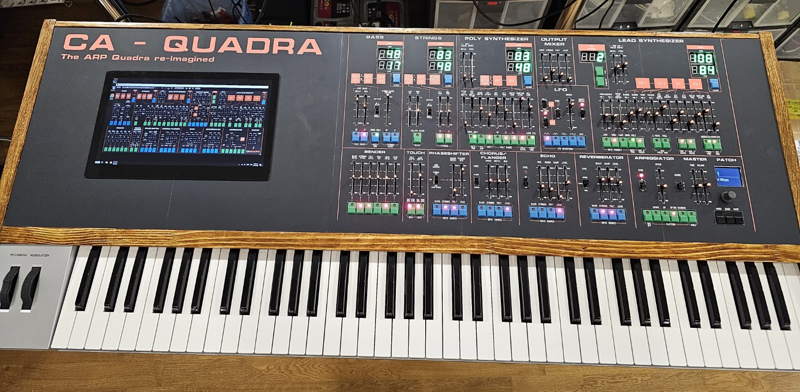

# Quadra-VST-editor---Cherry-Audio
A Hardware editor for the Cherry Audio Quadra VST

This is my attempt to make a physical hardware editor for the Cherry Audio Arp Quadra VST. 

First of all let me say I started building this without really understanding how the Quadra was controlled over MIDI, my knowledge was based on my experience with Arturia and building an editor for their CS80 VST.

So not long after construction started I did some testing and realized that the Cherry Audio VSTs uses toggling of buttons based on sending the same CC message or Note on/off etc. So this gives me a problem straight away in that I cannot change a specific button to on or off without knowing it's current status. I have asked Cherry Audio to implement on/off based on cc value 127 and 0 to make things easier. Let's see if it's implemented in a later release. Also there are a few buttons that toggle through multiple values, so these are impossible to control as you don't know where they are at any given time. And finally there seems to be a bug in the selection of the arp direction when controlling over MIDI.

So the project is Teensy 4.1 based with 5*16 channel mux chips used to read pots and slide switches and 9 shift register pairs used for push buttons and LEDs. I have also used a MAX7219 to control the slider LEDs, but the project could be built without LED sliders if desired.

I have included some schematics and it can hold 999 programs. if you create a totally blank patch in the Quadra VST then each program selection on the editor will update the VST with the correct values.

